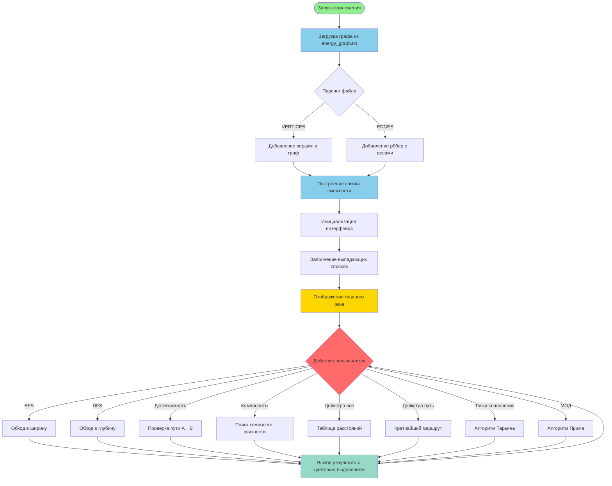

> *Лабораторные работы №4-6* по дисциплине "Алгоритмизация и программирование"  
> *Вариант 23* | Тверской государственный технический университет

Программный комплекс для анализа топологии энергосистемы с использованием классических алгоритмов на графах. Реализует обходы графа, поиск кратчайших путей, выявление критических узлов и построение минимального остовного дерева.

### 🔍 Алгоритмы обхода графа (ЛР4)
- **BFS** (Breadth-First Search) — обход в ширину
- **DFS** (Depth-First Search) — обход в глубину
- **Проверка достижимости** вершин с восстановлением пути
- **Поиск компонент связности** графа

### 🛣️ Алгоритмы поиска путей (ЛР5)
- **Алгоритм Дейкстры** — поиск кратчайших путей во взвешенном графе
- Вывод таблицы расстояний до всех вершин
- Восстановление маршрута с пошаговой трассировкой

### 🔧 Структурный анализ графа (ЛР6)
- **Алгоритм Тарьяна** — поиск точек сочленения (критических узлов)
- **Алгоритм Прима** — построение минимального остовного дерева (МОД)
- Анализ отказоустойчивости энергосистемы

### 🖥️ Графический интерфейс
- Интуитивный интерфейс на Windows Forms
- Цветовое выделение результатов
- Выбор начальной и конечной вершин через выпадающие списки
- Информационная панель с характеристиками графа

---

## 🛠️ Технологии

| Технология | Версия | Назначение |
|------------|--------|------------|
| **.NET** | 8.0 | Платформа разработки |
| **C#** | 12.0 | Язык программирования |
| **Windows Forms** | — | Графический интерфейс |
| **NUnit** | 4.x | Фреймворк тестирования |
| **Coverlet** | — | Анализ покрытия кода |

**Асимптотическая сложность алгоритмов:**
- BFS, DFS: `O(|V| + |E|)`
- Дейкстра: `O(|V|²)` (линейный поиск минимума)
- Тарьян: `O(|V| + |E|)`
- Прим: `O(|V|²)` (линейный поиск минимума)

---

## 📁 Блок-схема проекта



---

## 📂 Структура проекта

```
Lab4_23/
├── Lab4_23/                      # Основной проект
│   ├── Graph.cs                  # Класс графа и алгоритмы
│   ├── Form1.cs                  # Логика интерфейса
│   ├── Form1.Designer.cs         # Дизайн интерфейса
│   ├── Program.cs                # Точка входа
│   └── energy_graph.txt          # Граф энергосистемы (16 вершин, 22 ребра)
│
├── Lab4_23.Tests/                # Проект тестирования
│   ├── GraphTests.cs             # Модульные тесты (65 тестов)
│   └── coverage/                 # Отчёты о покрытии кода
│
└── Lab4_23.sln                   # Solution-файл
```

---

## 🚀 Установка и запуск

### Требования
- Windows 10/11
- .NET 8.0 SDK 
- Visual Studio 2022 

### Клонирование репозитория
```bash
git clone https://github.com/ваш-username/Lab4_23.git
cd Lab4_23
```

### Запуск приложения

**Через командную строку:**
```bash
dotnet run --project Lab4_23
```

**Через Visual Studio:**
1. Откройте `Lab4_23.sln`
2. Нажмите `F5` или `Ctrl+F5`

### Запуск тестов
```bash
# Запуск всех тестов
dotnet test

# Запуск с отчётом о покрытии
dotnet test /p:CollectCoverage=true /p:CoverletOutputFormat=lcov
```

---

## 💡 Использование

### 1. Загрузка графа
При запуске приложения автоматически загружается файл `energy_graph.txt` из директории проекта.

### 2. Выбор вершин
Используйте выпадающие списки для выбора начальной и конечной вершин.

### 3. Запуск алгоритмов

#### Обходы графа
- **BFS** — обход в ширину от выбранной вершины
- **DFS** — обход в глубину от выбранной вершины

#### Анализ связности
- **Достижимость** — проверка пути между двумя вершинами
- **Компоненты связности** — разбиение графа на связные подграфы

#### Кратчайшие пути
- **Дейкстра: все расстояния** — таблица расстояний от выбранной вершины
- **Дейкстра: маршрут A→B** — кратчайший путь с трассировкой

#### Структурный анализ
- **Точки сочленения** — критические узлы энергосистемы
- **МОД (алгоритм Прима)** — минимальная связывающая инфраструктура

---

## 🧮 Реализованные алгоритмы

### 1. BFS (Breadth-First Search)
```csharp
public List<string> BFS(string start)
```
Обход графа в ширину с использованием очереди. Возвращает порядок посещения вершин.

### 2. DFS (Depth-First Search)
```csharp
public List<string> DFS(string start)
```
Итеративный обход в глубину с использованием стека. Избегает переполнения стека вызовов.

### 3. Проверка достижимости
```csharp
public (bool reachable, List<string> path) IsReachable(string source, string target)
```
BFS с восстановлением пути через словарь предков.

### 4. Компоненты связности
```csharp
public List<List<string>> GetConnectedComponents()
```
Итеративный запуск BFS для всех непосещённых вершин.

### 5. Алгоритм Дейкстры
```csharp
public (Dictionary<string, int> dist, Dictionary<string, string?> previous) Dijkstra(string source)
```
Поиск кратчайших путей во взвешенном графе с неотрицательными весами.

### 6. Алгоритм Тарьяна
```csharp
public List<string> FindArticulationPoints()
```
Поиск точек сочленения за один проход DFS. Вычисляет значения `disc[]` и `low[]`.

### 7. Алгоритм Прима
```csharp
public List<(string from, string to, int weight)> BuildMST_Prim()
```
Построение минимального остовного дерева жадным методом.

---


## 🏭 Предметная область

### Граф энергосистемы (Вариант 23)

**Характеристики:**
- **Вершины:** 16 (4 электростанции + 12 подстанций)
- **Рёбра:** 22 линии электропередачи
- **Веса:** Мощность линий в МВт (120-600 МВт)
- **Тип:** Неориентированный взвешенный граф

### Типы узлов

| Тип | Примеры | Назначение |
|-----|---------|------------|
| **Электростанции** | ЭС_Центральная, ЭС_Северная | Источники энергии |
| **Крупные подстанции** | ПС_2_Промышленная, ПС_7_Центральная | Транзитные узлы |
| **Конечные подстанции** | ПС_11_Больница, ПС_10_Аэропорт | Потребители |

### Формат файла `energy_graph.txt`

```
VERTICES
ЭС_Центральная
ЭС_Северная
...

EDGES
ЭС_Центральная;ПС_7_Центральная;500
ЭС_Центральная;ПС_2_Промышленная;400
...
```

**Формат рёбер:** `Вершина1;Вершина2;Мощность(МВт)`

---

## 📊 Практическая значимость

### Применение в энергетике

1. **Анализ связности сети**
   - Проверка достижимости узлов
   - Выявление изолированных сегментов

2. **Оптимизация маршрутов**
   - Поиск путей с минимальными потерями
   - Диспетчеризация энергопотоков

3. **Оценка отказоустойчивости**
   - Выявление критических узлов (точки сочленения)
   - Планирование резервирования

4. **Проектирование инфраструктуры**
   - Минимизация капитальных затрат (МОД)
   - Выявление избыточных линий

---

## 👨‍💻 Автор

**Пестов Михаил Александрович**  
Студент 1 курса, группа Б.ПИН.ИИ.25.16  
Тверской государственный технический университет

**Преподаватель:** Лисничук Арина Бахытжановна

---
